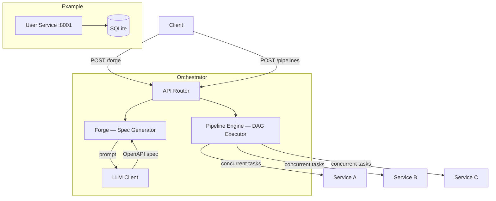
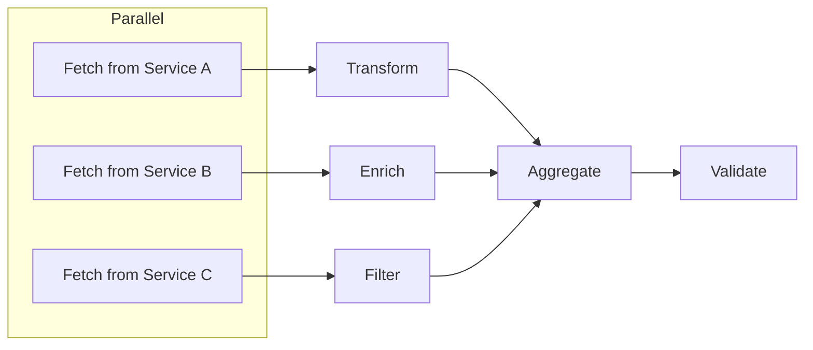
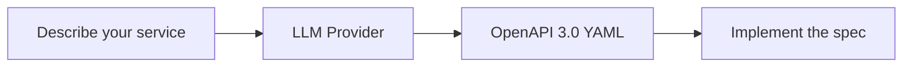

# MicroForge

MicroForge is a microservice orchestration platform built in Rust. It automates two core problems in distributed architectures:

**Service creation** — Describe a microservice in plain English. MicroForge calls an LLM to produce a full OpenAPI 3.0 specification with endpoints, schemas, and status codes. No manual spec writing.

**Service coordination** — Define multi-step workflows that span across services. MicroForge executes them as a DAG: independent steps run in parallel, dependent steps wait, failures cascade automatically. No manual scheduling.

---

## Overview



The **Forge** generates service contracts from natural language. The **Pipeline Engine** orchestrates data flows across those services — fetching, transforming, aggregating, and validating data concurrently.

---

## How Pipelines Work

You submit a set of tasks with dependencies. The engine builds a DAG, checks for cycles, and executes it:



- Tasks with no dependencies start immediately and run concurrently
- Each task waits only for its declared upstream dependencies
- If a task fails, everything downstream is skipped
- The graph is validated for cycles before execution (topological sort)

A pipeline with 3 service calls at ~800ms each completes in ~800ms, not ~2400ms.

---

## How Forge Works



Send a prompt to `POST /forge`:

```bash
curl -X POST http://localhost:8000/forge \
  -H "Content-Type: application/json" \
  -d '{"prompt": "A product catalog with SKU, name, price, and stock"}'
```

The orchestrator sends this to whichever LLM you configured (local Ollama, OpenAI, Anthropic, etc.) and returns a complete spec with CRUD endpoints, schemas, and status codes. The included `user_service` is an example of a service built from such a spec.

---

## Quick Start

```bash
git clone https://github.com/mutabay/MicroForge.git
cd MicroForge

ollama pull llama3.1:8b            # or set up a cloud provider in .env

cargo run --bin user_service       # terminal 1 → localhost:8001
cargo run --bin orchestrator       # terminal 2 → localhost:8000
```

Docker alternative:

```bash
cp .env.example .env               # set your LLM provider and keys
docker compose up --build
```

---

## Example: Run a Pipeline

```bash
curl -X POST http://localhost:8000/pipelines \
  -H "Content-Type: application/json" \
  -d '{
    "name": "collect_and_validate",
    "tasks": [
      {"id": "users",   "task_type": "http_fetch", "config": {"url": "http://localhost:8001/users"}},
      {"id": "weather", "task_type": "http_fetch", "config": {"url": "https://httpbin.org/get"}},
      {"id": "clean",   "task_type": "transform",  "depends_on": ["users"],   "config": {"operation": "normalize"}},
      {"id": "enrich",  "task_type": "transform",  "depends_on": ["weather"], "config": {"operation": "enrich"}},
      {"id": "merge",   "task_type": "aggregate",  "depends_on": ["clean", "enrich"], "config": {"strategy": "merge"}},
      {"id": "check",   "task_type": "validate",   "depends_on": ["merge"],   "config": {"schema": "output_v1"}}
    ]
  }'
```

The two fetches (`users` from your service, `weather` from an external API) run in parallel. The rest of the DAG follows the dependency order.

---

## Endpoints

| Method | Path | Description |
|--------|------|-------------|
| `POST` | `/forge` | Generate an OpenAPI spec from a prompt |
| `POST` | `/pipelines` | Execute a pipeline |
| `GET` | `/pipelines` | List past runs |
| `GET` | `/pipelines/{id}` | Get a specific result |
| `GET` | `/services` | List registered services |
| `GET` | `/health` | Health check |

---

## Project Structure

| File | Role |
|------|------|
| `orchestrator/src/main.rs` | HTTP server, routing, shared state |
| `orchestrator/src/pipeline.rs` | DAG executor — validation, concurrent scheduling, failure handling |
| `orchestrator/src/llm.rs` | LLM client — pluggable across providers via env config |
| `orchestrator/src/forge.rs` | Natural language → OpenAPI spec generation |
| `services/user_service/src/main.rs` | Reference CRUD microservice with Swagger UI |
| `services/user_service/src/models.rs` | Domain types |
| `services/user_service/src/db.rs` | SQLite pool with auto-migration |
| `docker-compose.yml` | Container deployment |
| `.env.example` | Configuration reference |

---

## Configuration

Set `LLM_PROVIDER` to choose a backend. Provider-specific variables are in [.env.example](.env.example).

| Provider | `LLM_PROVIDER` |
|----------|-----------------|
| Ollama (local) | `ollama` |
| OpenAI | `openai` |
| Anthropic | `anthropic` |
| Groq | `groq` |
| Together AI | `together` |
| Any OpenAI-compatible API | `custom` |

---

## Tests

```bash
cargo test
```

```
test pipeline::tests::test_cycle_detection ... ok
test pipeline::tests::test_linear_pipeline ... ok
test pipeline::tests::test_concurrent_fanout ... ok
```

---

## References

Chauhan, S. et al. (2025). [*LLM-Generated Microservice Implementations from RESTful API Definitions*](https://arxiv.org/abs/2502.09766)
